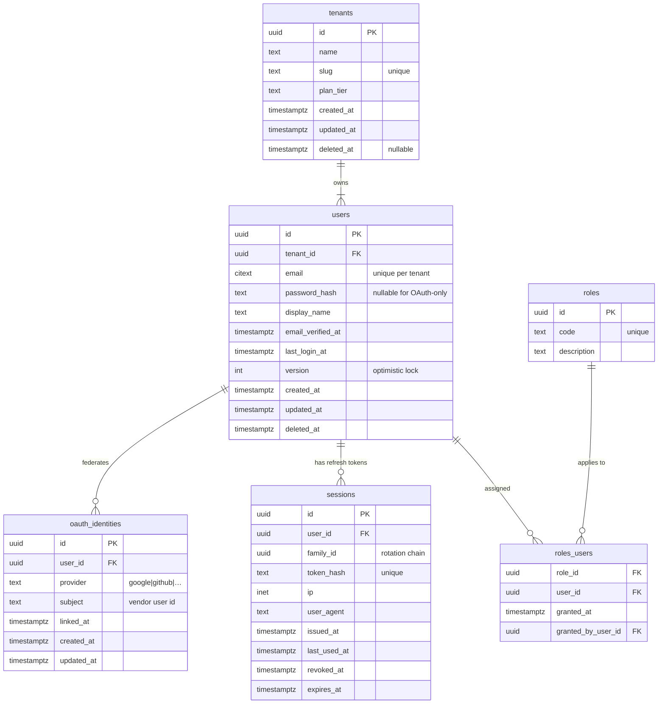
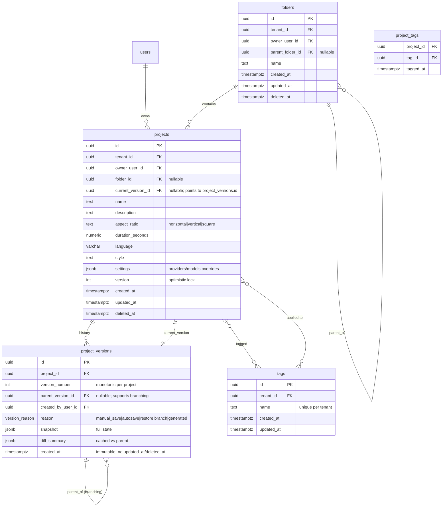
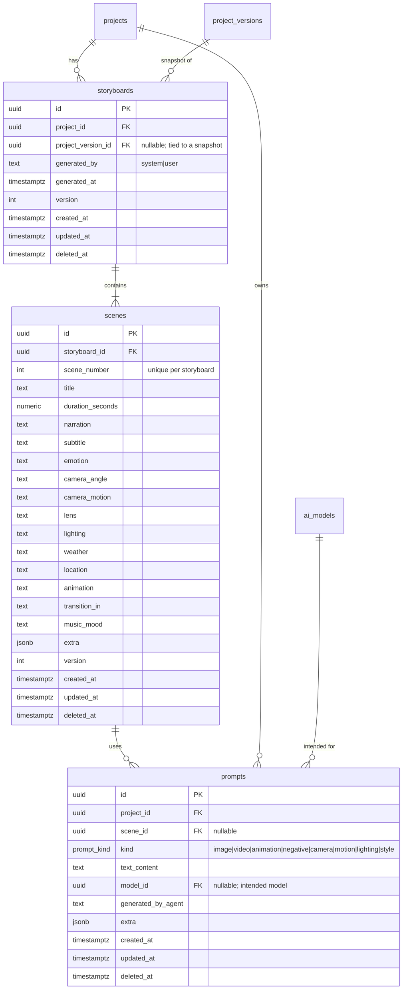
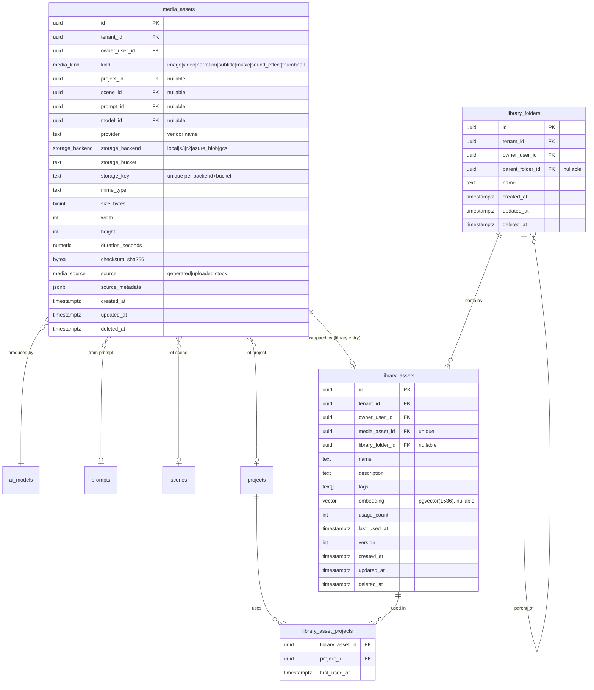
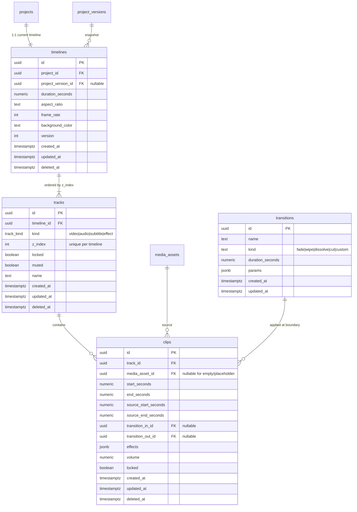
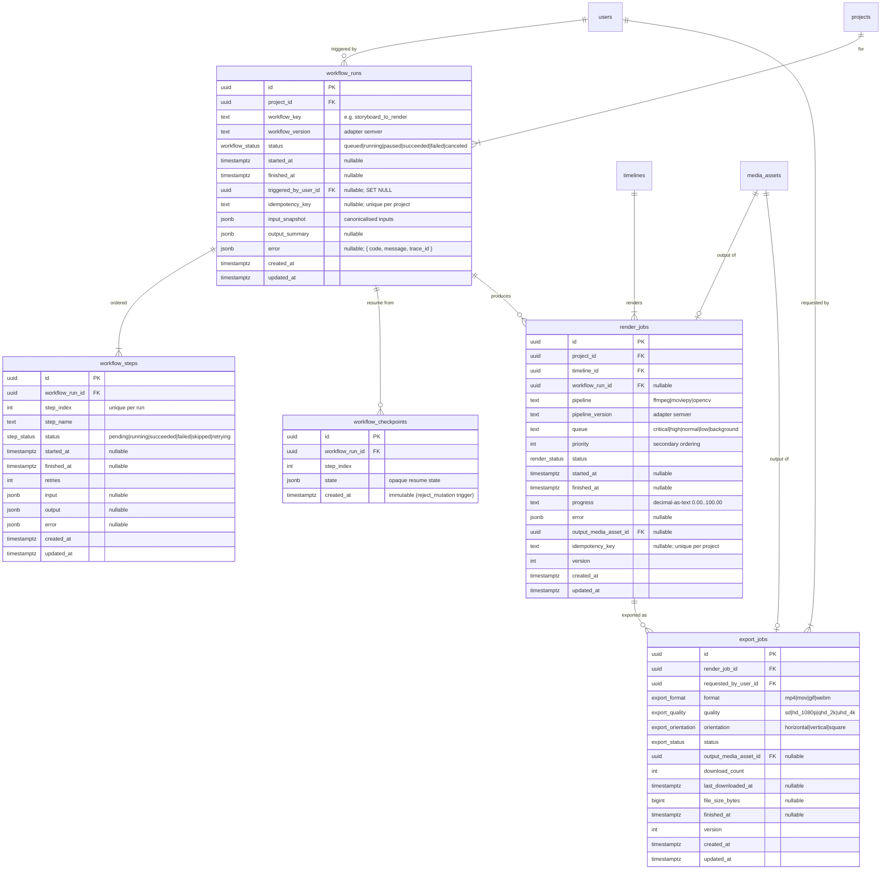
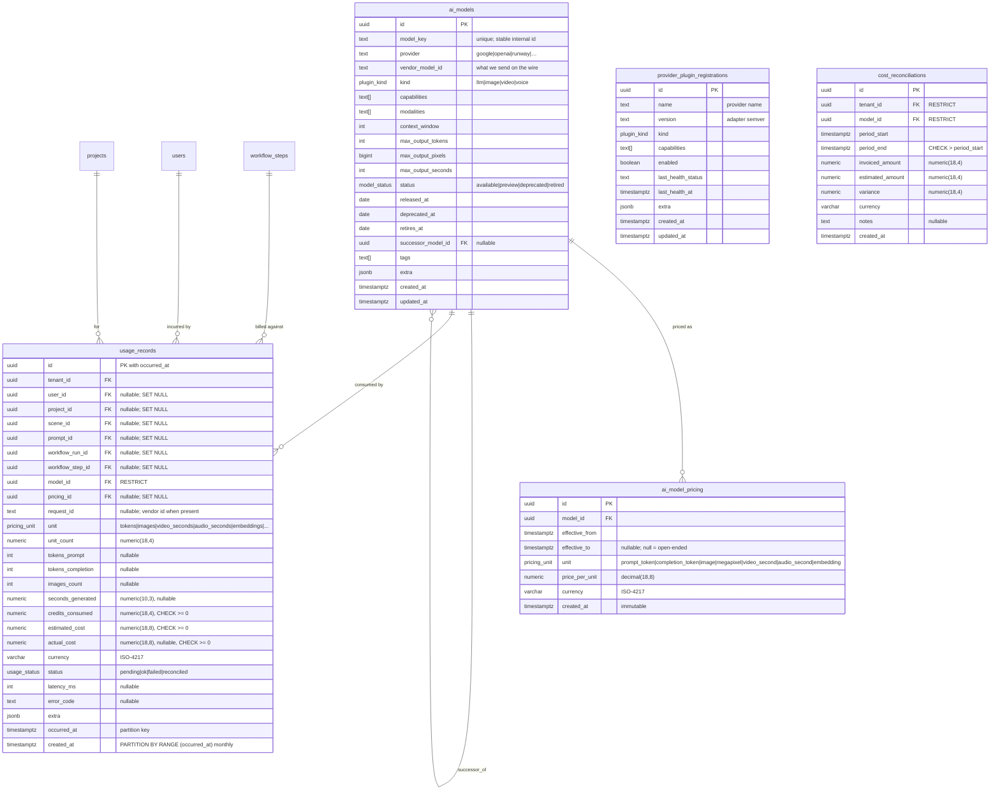
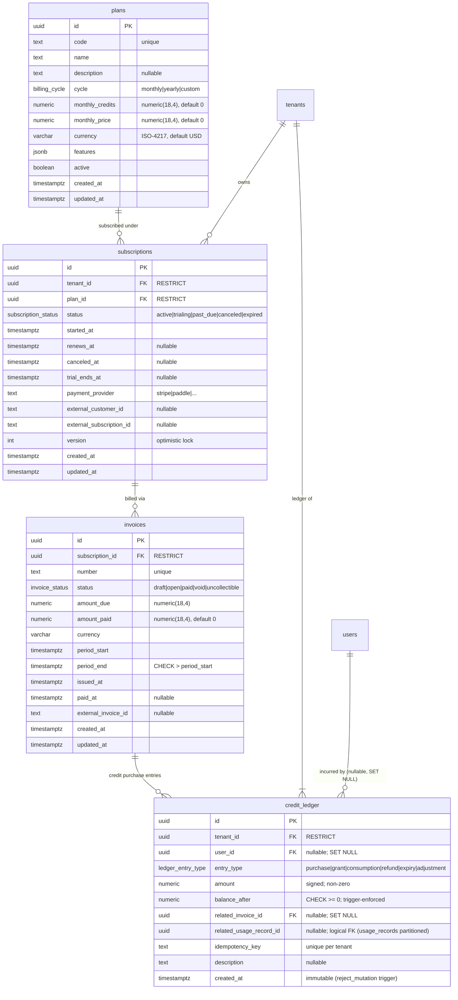

# Entity Relationship Diagram (ERD)

> **Phase 2 Step A artifact, reconciled in Phase 2D (2026-06-29).** Covers every aggregate root listed in `ARCHITECTURE.md` §6 plus required infrastructure tables (outbox, event log, partitions, plugin registry). Diagrams are split into clusters for readability; cross-cluster references are listed at the end.
>
> **Phase 2D reconciliation note.** Column shapes in each mermaid block were updated to match the validated ORM (`app/infrastructure/db/models/`) and the live schema as of `validate_schema.py` 2026-06-29. Where this document and the live schema disagreed, the implementation was treated as the source of truth (audit rule, see `schema.md` preamble). Cluster-split FK edges that exist as logical references but are not declared in the implementation are noted as Mermaid comments, not drawn as `||--o{` edges, to keep `regenerate_erd.py + compare_erd.py` ≡ 0 design-edge drift. Whether to promote any of those logical FKs to real DB constraints is a Phase-3 entry decision (see `schema.md` §37).

Legend used in every diagram:

```
{ }   primary key
PK    primary key (alt notation)
FK    foreign key
"||"  one-and-only-one
"o|"  zero-or-one
"|{"  one-to-many (required parent)
"o{"  zero-or-many (optional parent)
```

---

## Cluster 1 — Identity & Tenancy



---

## Cluster 2 — Projects & Versions (CR-6)



---

## Cluster 3 — AI Content (Storyboards, Scenes, Prompts)



---

## Cluster 4 — Media Assets & Asset Library (CR-8)



---

## Cluster 5 — Timeline



---

## Cluster 6 — Workflows, Render & Export (CR-7)



> **Reconciled in 2D:** column shapes match `workflows.py` / `jobs.py`
> ORM models and the live schema as of 2026-06-29. Project_version_id,
> deleted_at, paused_at, correlation_id, queue_name, attempts, error_code+error_message
> are not implemented and were removed from the diagram (rationale in `schema.md` §16–§17).

---

## Cluster 7 — AI Models, Plugins & Cost Tracking (CR-11, CR-12)



> **Reconciled in 2D:** `usage_records` partition key was renamed from
> `started_at` to `occurred_at`; provider/vendor_model_id/capability
> and the legacy "logical FK" annotation were removed — every
> relational column is a real FK now. Costs are `numeric(18,8)` (not
> integer cents). `cost_reconciliations` aggregates per
> `(tenant_id, model_id, period)` rather than per usage record (see
> `schema.md` §19 for rationale).

---

## Cluster 8 — Billing, Plans & Credit Ledger



> **Reconciled in 2D:** subscriptions/invoices are now tenant-scoped
> (no `user_id`; per ADR-0027). The Step-A `current_period_start/end` /
> `ended_at` columns are replaced by `started_at` + `renews_at` +
> `canceled_at` + `trial_ends_at`; `stripe_*` were generalised to
> `payment_provider` + `external_customer_id` + `external_subscription_id`
> so Paddle/Lemon Squeezy/etc. work without a migration. Amounts
> are `numeric(18,4)` decimals (not integer cents) — matches the
> usage-record cost decision. `plans.billing_cycle` → `cycle`,
> `price_cents` → `monthly_price`, `credits_per_cycle` →
> `monthly_credits`.

---

## Cluster 9 — Cross-Cutting (Flags, Notifications, Events, Templates, Webhooks)

```mermaid
erDiagram
    feature_flags        ||--o{ feature_flag_overrides : "scoped by"
    users                ||--o{ notifications          : "addressed to"
    users                ||--o{ analytics_events       : "performed"
    %% event_outbox and event_log are independent tables (no FK):
    %%   outbox = transactional staging; event_log = durable audit. The dispatcher
    %%   reads outbox rows and writes event_log rows in the application layer.

    feature_flags {
        uuid id PK
        text key "unique"
        text description "nullable"
        flag_type flag_type "boolean|percent|variant"
        jsonb default_value
        int rollout_percent "nullable; CHECK 0..100"
        jsonb variants "nullable; for variant flags"
        boolean archived "default false"
        int version
        timestamptz created_at
        timestamptz updated_at
    }
    feature_flag_overrides {
        uuid id PK
        uuid feature_flag_id FK
        flag_scope scope "tenant|user|project"
        uuid scope_id "interpreted per scope"
        jsonb value
        timestamptz expires_at "nullable"
        timestamptz created_at
        timestamptz updated_at
    }
    notifications {
        uuid id PK
        uuid tenant_id FK
        uuid user_id FK
        text kind
        text title
        text body
        jsonb payload
        timestamptz read_at "nullable"
        timestamptz created_at
        timestamptz updated_at
    }
    analytics_events {
        uuid id "PK with occurred_at"
        uuid tenant_id "nullable"
        uuid user_id "nullable"
        text session_id
        text event_name
        jsonb properties
        timestamptz occurred_at "partition key"
        timestamptz ingested_at
        timestamptz created_at "PARTITION BY RANGE (occurred_at)"
    }
    event_outbox {
        uuid id PK
        text aggregate_type
        uuid aggregate_id
        text event_type "from infrastructure/events/topics.py"
        text event_version "semver; default '1.0'"
        jsonb payload
        jsonb metadata "carries correlation_id, causation_id, trace_id"
        timestamptz occurred_at "NOT NULL"
        timestamptz published_at "nullable; partial index for dispatcher"
        int attempts
        text last_error "nullable"
        timestamptz created_at
    }
    event_log {
        uuid id "PK with occurred_at"
        text aggregate_type
        uuid aggregate_id
        bigint aggregate_version "monotonic per aggregate"
        text event_type
        text event_version
        jsonb payload
        jsonb metadata "correlation, causation, trace, tenant_id"
        timestamptz occurred_at "partition key; PARTITION BY RANGE (occurred_at)"
    }
    templates {
        uuid id PK
        uuid tenant_id "nullable; null = global"
        text name
        text kind "video_template|script_template|storyboard_template"
        jsonb content
        uuid preview_media_asset_id "nullable"
        uuid created_by_user_id "nullable"
        boolean active
        timestamptz created_at
        timestamptz updated_at
        timestamptz deleted_at
    }
    webhook_deliveries {
        uuid id PK
        text source "stripe|provider:<name>"
        text source_event_id "unique with source"
        text signature
        jsonb payload
        timestamptz received_at "NOT NULL"
        timestamptz processed_at
        text processing_status "pending|done|failed"
        text last_error
    }
    agent_memory {
        uuid id PK
        uuid user_id FK
        uuid project_id FK "nullable"
        text agent_name
        text memory_kind "short_term|long_term|summary"
        jsonb content
        vector embedding "pgvector(1536), nullable"
        timestamptz created_at
        timestamptz updated_at
        timestamptz expires_at "nullable; short-term TTL"
    }
```



---

---

## Cluster 10 — Configuration & Operations (CR-DB-1 … CR-DB-4)

```mermaid
erDiagram
    tenants ||--o{ idempotency_keys   : "scoped to"
    tenants ||--o{ tenant_settings    : "configured by"
    tenants ||--o{ provider_settings  : "configured by"
    users   ||--o{ system_settings    : "last updated by"
    users   ||--o{ tenant_settings    : "last updated by"
    users   ||--o{ provider_settings  : "last updated by"
    users   ||--o{ audit_log          : "actor"
    tenants ||--o{ audit_log          : "scoped to"

    idempotency_keys {
        uuid id PK
        uuid tenant_id FK "CASCADE"
        text key
        text resource_type "payment|ai_generation|export_job|workflow_retry|webhook"
        uuid resource_id "nullable"
        text request_hash "hex-encoded SHA-256"
        text response_hash "nullable"
        jsonb response_payload "nullable"
        idempotency_status status "in_flight|succeeded|failed"
        text http_status "nullable; kept as text"
        timestamptz expires_at
        timestamptz created_at
    }
    distributed_locks {
        text lock_key PK
        text owner "worker id"
        timestamptz lease_until
        timestamptz heartbeat_at
        timestamptz acquired_at
        jsonb metadata
    }
    audit_log {
        uuid id "PK with occurred_at"
        uuid tenant_id FK "nullable for platform actions; SET NULL"
        audit_actor_kind actor_kind "user|system|admin|api_key|webhook"
        uuid actor_user_id FK "nullable; SET NULL"
        text actor_label "nullable; label for non-user actors"
        text entity_type "project|feature_flag|credit_ledger|ai_model|…"
        uuid entity_id "nullable for bulk"
        text action "create|update|delete|enable|disable|adjust|restore|…"
        jsonb before_json "null on create"
        jsonb after_json "null on delete"
        uuid correlation_id "nullable"
        text request_id "nullable; supports trace ids"
        inet ip "nullable"
        text user_agent "nullable"
        timestamptz occurred_at "PARTITION BY RANGE (occurred_at) monthly"
    }
    system_settings {
        uuid id PK
        text key "unique"
        jsonb value
        text description "nullable"
        boolean is_secret
        uuid updated_by_user_id FK "nullable"
        int version "optimistic lock"
        timestamptz created_at
        timestamptz updated_at
    }
    tenant_settings {
        uuid id PK
        uuid tenant_id FK "CASCADE"
        text key
        jsonb value
        text description "nullable"
        boolean is_secret
        uuid updated_by_user_id FK "nullable"
        int version
        timestamptz created_at
        timestamptz updated_at
    }
    provider_settings {
        uuid id PK
        text provider "openai|google|runway|…"
        uuid tenant_id FK "nullable; null = global default; CASCADE"
        text key "api_key|region|base_url|rate_limit_rps|enabled"
        jsonb value
        boolean is_secret
        uuid updated_by_user_id FK "nullable"
        int version
        timestamptz created_at
        timestamptz updated_at
    }
```



> **Reconciled in 2D:** `idempotency_keys` uses text hex hashes (not
> `bytea`); `http_status` is text; `updated_at` dropped (every transition
> emits an audit event). `distributed_locks` makes `lock_key` the
> primary key directly. `audit_log` splits actor into `actor_user_id`
> (real FK) + `actor_label` (free-form for api keys / webhooks /
> schedulers); `reason` is folded into `after_json`. `provider_settings`
> drops the `kind` discriminator (single namespace by `provider`+`key`).
> All three settings tables gained a `version` column (`VersionMixin`).

> `feature_flag_overrides` (the fourth CR-DB-4 table) is shown in **Cluster 9** and is unchanged from the previous revision.

---

## Cross-Cluster Foreign-Key Summary

These FKs span clusters and are easy to miss; documented here for review:

| From → To | Cardinality | ON DELETE |
|---|---|---|
| `projects.owner_user_id` → `users.id` | many:1 | RESTRICT (users have a soft-delete tombstone process) |
| `projects.current_version_id` → `project_versions.id` | 1:1 (head pointer) | SET NULL (FK is informational; truth is in `project_versions`) |
| `media_assets.model_id` → `ai_models.id` | many:1 | RESTRICT (audit integrity) |
| `media_assets.prompt_id` → `prompts.id` | many:1 | SET NULL |
| `library_assets.media_asset_id` → `media_assets.id` | 1:1 | RESTRICT (library wraps a real asset; deletion is via library) |
| `clips.media_asset_id` → `media_assets.id` | many:1 | SET NULL (clip becomes a placeholder) |
| `render_jobs.output_media_asset_id` → `media_assets.id` | 1:1 | SET NULL |
| `export_jobs.output_media_asset_id` → `media_assets.id` | 1:1 | SET NULL |
| `workflow_runs.project_id` → `projects.id` | many:1 | SET NULL (run history survives project deletion) |
| `usage_records.model_id` → `ai_models.id` | many:1 | RESTRICT (immutable) |
| `usage_records.tenant_id/user_id/project_id` | many:1 | RESTRICT |
| `credit_ledger.user_id/tenant_id` | many:1 | RESTRICT |
| `credit_ledger.invoice_id` → `invoices.id` | many:1 | RESTRICT |
| `ai_models.successor_model_id` → `ai_models.id` | self | SET NULL |
| `feature_flag_overrides.flag_id` → `feature_flags.id` | many:1 | CASCADE |
| `subscriptions.plan_id` → `plans.id` | many:1 | RESTRICT |

Logical FKs (no DB-level constraint, because the target table is partitioned and a composite FK would be needed):

| From → To | Reason |
|---|---|
| `workflow_steps.usage_record_id` → `usage_records.id` | usage_records is partitioned; FK requires (id, started_at) |
| `cost_reconciliations.usage_record_id` → `usage_records.id` | same |
| `credit_ledger.usage_record_id` → `usage_records.id` | same |

These are validated at application level via repository-layer checks plus an integrity job in Phase 10.

---

## Aggregate Root Coverage Check

Verifying that every aggregate root from `ARCHITECTURE.md` §6 has a table:

| Aggregate Root | Primary Table |
|---|---|
| `User` | `users` |
| `Project` (with `ProjectVersion`s) | `projects`, `project_versions` |
| `Storyboard` (with `Scene`s) | `storyboards`, `scenes` |
| `Prompt` | `prompts` |
| `Image / Video / Narration / Subtitle / Music / SoundEffect / Thumbnail` | `media_assets` (discriminated by `kind`) |
| `Timeline` (with `Track`s & `Clip`s) | `timelines`, `tracks`, `clips`, `transitions` |
| `RenderJob` | `render_jobs` |
| `ExportJob` | `export_jobs` |
| `WorkflowRun` (with `WorkflowStep`s & `Checkpoint`s) | `workflow_runs`, `workflow_steps`, `workflow_checkpoints` |
| `LibraryAsset` | `library_assets`, `library_folders`, `library_asset_projects` |
| `Subscription` | `subscriptions`, `plans`, `invoices` |
| `CreditLedger` (aggregate root) / `CreditTransaction` (entries) | `credit_ledger` |
| `AnalyticsEvent` | `analytics_events` |
| `Notification` | `notifications` |
| `FeatureFlag` | `feature_flags`, `feature_flag_overrides` |
| `AIModel` | `ai_models`, `ai_model_pricing`, `provider_plugin_registrations` |
| `UsageRecord` | `usage_records`, `cost_reconciliations` |

**Coverage = 100%.** No aggregate root is missing.

Additional infrastructure tables not tied to an aggregate root: `tenants`, `sessions`, `oauth_identities`, `roles`, `roles_users`, `folders`, `tags`, `project_tags`, `system_settings`, `tenant_settings`, `provider_settings`, `templates`, `event_outbox`, `event_log`, `webhook_deliveries`, `agent_memory`, `idempotency_keys` (CR-DB-1), `distributed_locks` (CR-DB-2), `audit_log` (CR-DB-3).

---

## Notes for Step B (Implementation)

- All `timestamptz` columns are stored UTC; the Python layer never writes naïve datetimes.
- Partitioned tables (`usage_records`, `analytics_events`, `event_log`, optionally `logs`) are created with a partition-management Celery beat job that pre-creates next-month partitions and detaches expired ones (see `RETENTION_POLICY.md`).
- `pgvector` columns are nullable to allow lazy embedding generation.
- The `version` column starts at `1` on insert and is incremented by `tg_<table>_biu_version_bump` on every update.
- The `tg_<table>_biu_touch_updated_at` trigger sets `updated_at = now()` on every update (skipping the no-op case where only `updated_at` changed).
